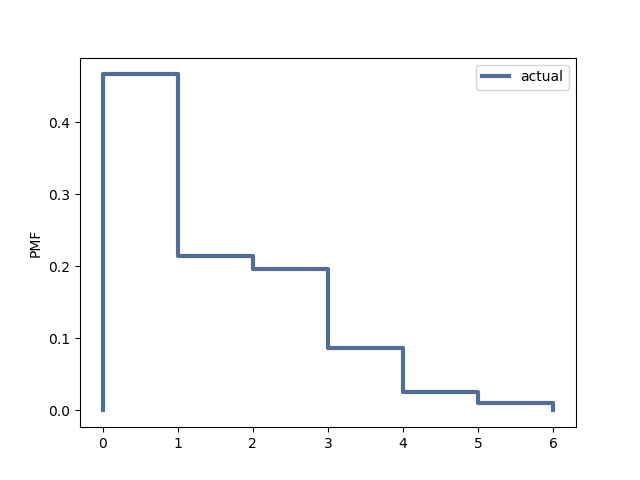
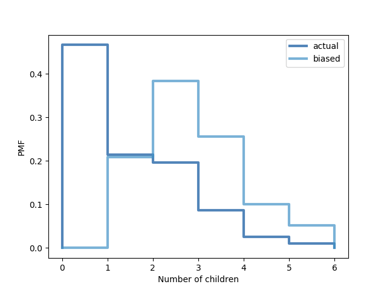

[Think Stats Chapter 3 Exercise 1](http://greenteapress.com/thinkstats2/html/thinkstats2004.html#toc31) (actual vs. biased)


```python
import numpy as np
import nsfg
import first
import thinkstats2
import thinkplot
import matplotlib
import matplotlib.pyplot as plt
```


```python
df = nsfg.ReadFemResp()
```


```python
# inspect the data
df.numkdhh.head(4)
```


    0    3
    1    0
    2    0
    3    0
    Name: numkdhh, dtype: int64


**Problem**: Calculate the actual distribution for the number of children under 18 in the household. Then calculate the biased distribution that we would get if we surveyed children and asked them how many children are in their household.

**How solved**: The biased sample arises from the fact that families with more children are more likely to be in your sample and families with no children will be absent from the sample -- hence to calculate this I multiply the actual probabilities associated with each number of kids by the number of children who observe that number. I then present the actual and biased means based on the pmfs.

### Actual


```python
x = df.numkdhh.value_counts()
d = {}
for a in x.index:
  d[x.index[a]] = x.iloc[a] / sum(x)
```


```python
# confirming probabilities sum to 1
sum(d.values())
```

```python
pmf = thinkstats2.Pmf(d, label='actual')
```


```python
# plot actual
thinkplot.Pmfs([pmf], align='left')
thinkplot.Config(xlablel = 'Number of children', ylabel = 'PMF')
plt.savefig('actual.png')
plt.close()
```





### Biased


```python
nd = {}
for a in x.index:
  nd[x.index[a]] = x.iloc[a] / sum(x) * x.index[a]

s = sum(nd.values())

# normalize
for x in nd:
  nd[x] = nd[x]/s
```


```python
biased_pmf = thinkstats2.Pmf(nd, label='biased')
```


```python
# plot actual and biased
thinkplot.PrePlot(2)
thinkplot.Pmfs([pmf, biased_pmf], align='left')
thinkplot.Config(xlabel='Number of children', ylabel='PMF')
plt.savefig('both.png')
plt.close()
```




### Means


```python
def Mean(y):
  mean = 0.0
  for x, p in y.items():
    mean += p * x
  return mean
```


```python
print('Actual mean is %f' % Mean(d))
print('Biased mean is %f' % Mean(nd))
```

    Actual mean is 1.024205
    Biased mean is 2.403679
