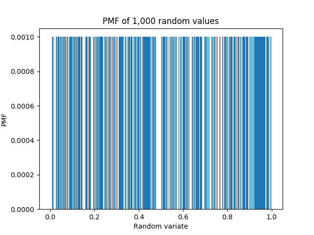

[Think Stats Chapter 4 Exercise 2](http://greenteapress.com/thinkstats2/html/thinkstats2005.html#toc41) (a random distribution)

```python

import numpy as np
import thinkstats2
from collections import Counter
import matplotlib.pyplot as plt
```

### PMF

```python
# generates array
x = np.random.random(1000)
# creates dict w/ count of each value
C = Counter(x)
# adds all values in dict C
total = float(sum(C.values()))
# divides each value by the total to create dict w/ values and probabilities
for key in C: C[key] /=total

plt.bar(list(C.keys()), C.values(), width=.001)
plt.ylabel('PMF')
plt.xlabel('Random values')
plt.title('PMF of 1,000 random values')
plt.savefig('PMF1000.png')
plt.close()

```


### CDF

```python


```
